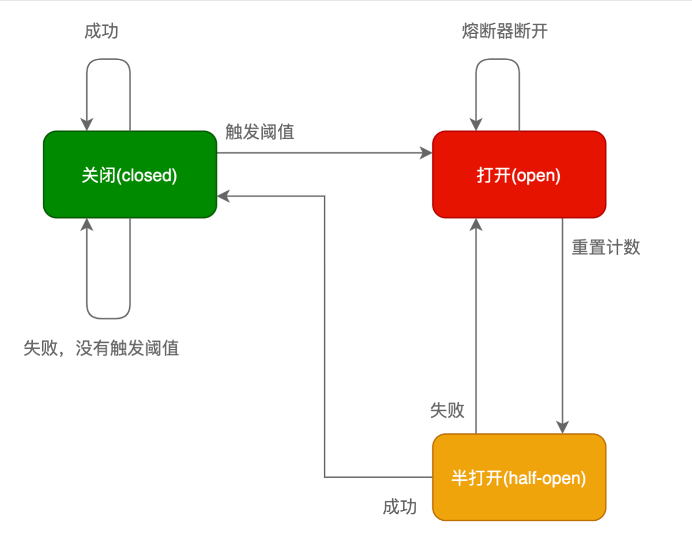
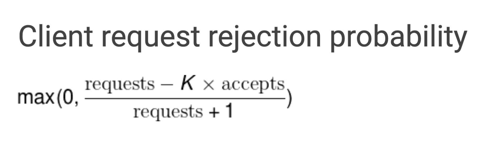

# php-breaker
webman 熔断器组件

- circuit-breaker 熔断器 继承 leocarmo/circuit-breaker-php 组件
- google-sre-breaker 熔断器

# 断路器

熔断机制其实是参考了我们日常生活中的保险丝的保护机制，当电路超负荷运行时，保险丝会自动的断开，从而保证电路中的电器不受损害。而服务治理中的熔断机制，指的是在发起服务调用的时候，如果被调用方返回的错误率超过一定的阈值，那么后续的请求将不会真正发起请求，而是在调用方直接返回错误

在这种模式下，服务调用方为每一个调用服务(调用路径)维护一个状态机，在这个状态机中有三个状态：

## 关闭(Closed)：

在这种状态下，我们需要一个计数器来记录调用失败的次数和总的请求次数，如果在某个时间窗口内，失败的失败率达到预设的阈值，则切换到断开状态，此时开启一个超时时间，当到达该时间则切换到半关闭状态，该超时时间是给了系统一次机会来修正导致调用失败的错误，以回到正常的工作状态。在关闭状态下，调用错误是基于时间的，在特定的时间间隔内会重置，这能够防止偶然错误导致熔断器进去断开状态。

## 打开(Open)：

在该状态下，发起请求时会立即返回错误，一般会启动一个超时计时器，当计时器超时后，状态切换到半打开状态，也可以设置一个定时器，定期的探测服务是否恢复。

## 半打开(Half-Open)：

在该状态下，允许应用程序一定数量的请求发往被调用服务，如果这些调用正常，那么可以认为被调用服务已经恢复正常，此时熔断器切换到关闭状态，同时需要重置计数。如果这部分仍有调用失败的情况，则认为被调用方仍然没有恢复，熔断器会切换到关闭状态，然后重置计数器，半打开状态能够有效防止正在恢复中的服务被突然大量请求再次打垮。

# Google Sre过载保护算法

https://sre.google/sre-book/handling-overload/#eq2101

Google Sre过载保护算法来实现客户端限制。具体来说，每个客户端任务在其历史记录的最后两分钟（这个时间可配置）中都会保留以下信息：

- 请求数量(requests)：调用方发起请求的数量总和
- 请求接受数量(accepts)：被调用方正常处理的请求数量

在正常情况下，这两个值是相等的，随着被调用方服务出现异常开始拒绝请求，请求接受数量(accepts)的值开始逐渐小于请求数量(requests)，这个时候调用方可以继续发送请求，直到requests = K * accepts，一旦超过这个限制，熔断器就回打开，新的请求会在本地以一定的概率被抛弃直接返回错误，概率的计算公式如下：

通过修改算法中的K(倍值)，可以调节熔断器的敏感度，当降低该倍值会使自适应熔断算法更敏感，当增加该倍值会使得自适应熔断算法降低敏感度，举例来说，假设将调用方的请求上限从 requests = 2 * acceptst 调整为 requests = 1.1 * accepts 那么就意味着调用方每十个请求之中就有一个请求会触发熔断。